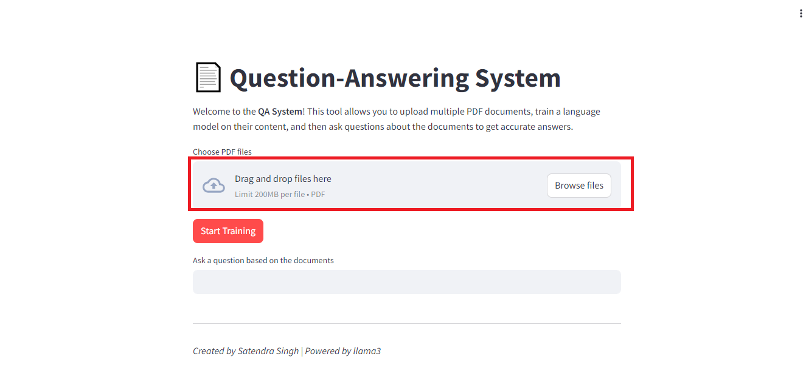
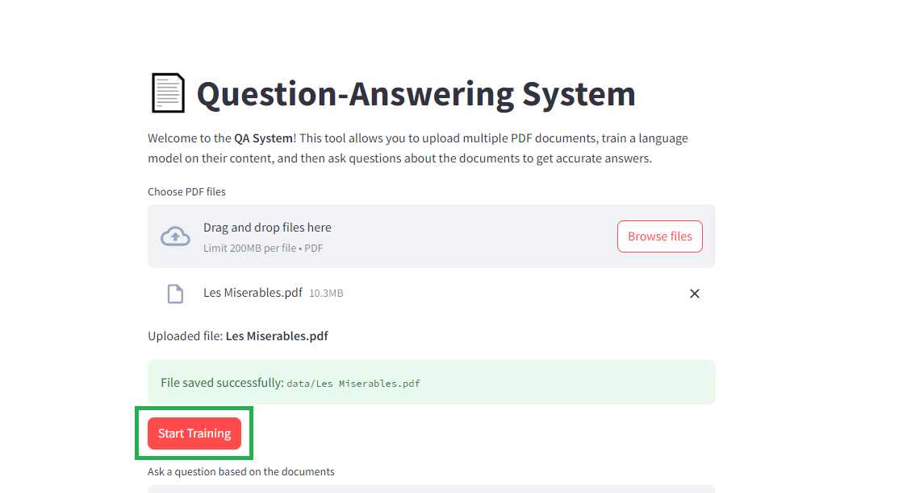
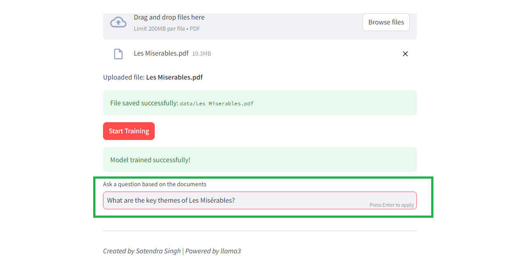
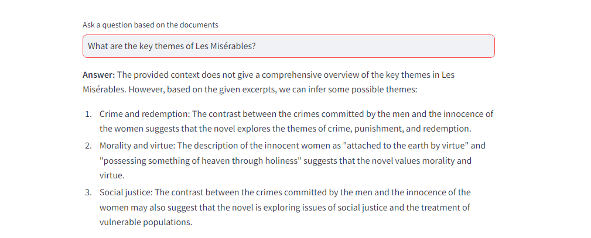

# RAG-QA-System-based-on-pdf

## 1. Run requirements.txt file
```pip install -r requirements.txt```

## 2. Run index.py file
```streamlit run index.py```

## 3. upload files all file 


## 4. start training


## 5. ask your question based on your document


## 6. you got your answer

